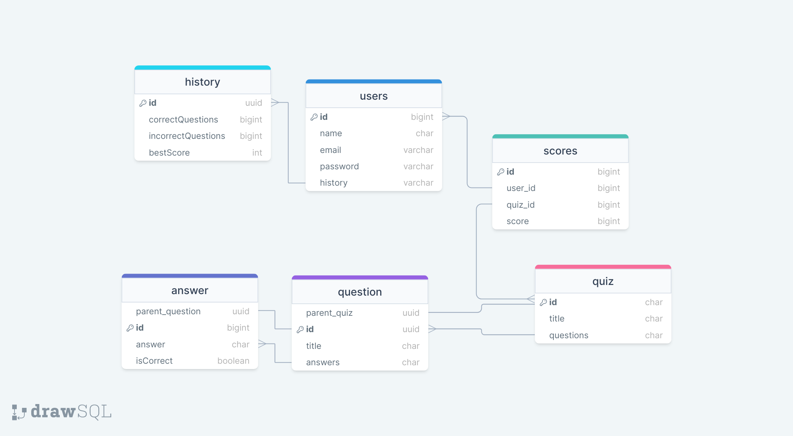

# JavaScript Quiz

A Full Stack JavaScript Quiz game.

I want to create a beautiful educative quiz with a leaderboard, with curated references and questions.

Will have a backend and a CMS where admins can update the content. (Add questions, answers, create quizes, update everything etc.)

#### Table of contents

- [How to Play & App Preview](https://github.com/janaiscoding/ydkjs-quiz?tab=readme-ov-file#how-to-play--app-preview)

- [API Reference & Endpoints](https://github.com/janaiscoding/ydkjs-quiz?tab=readme-ov-file#api-reference--endpoints)

- [Database & Visual Graph](https://github.com/janaiscoding/ydkjs-quiz?tab=readme-ov-file#database--visual-graph)

- [Getting Started & Installation](https://github.com/janaiscoding/ydkjs-quiz?tab=readme-ov-file#getting-started--installation)

- [Tech Stack & Tools](https://github.com/janaiscoding/ydkjs-quiz?tab=readme-ov-file#tech-stack--tools)

- [Other Information & More](https://github.com/janaiscoding/ydkjs-quiz?tab=readme-ov-file#others)

# How to Play & App Preview

* to be completed when the project gets released

# API Reference & Endpoints

## 🔐 Auth

| endpoint     | method | description        | protected | postman |           body            |
| ------------ | ------ | ------------------ | :-------: | :-----: | :-----------------------: |
| /auth/signup | `POST` | create new user    |    ❌     |   ✅    | `name` `email` `password` |
| /auth/login  | `POST` | sign in to account |    ❌     |   ✅    |    `email` `password`     |
| /auth/verify | `POST` | verify jwt token   |    ❌     |   ✅    |          `token`          |

## 🙋 User

| endpoint   | method | description                          | protected | postman |         body         |
| ---------- | ------ | ------------------------------------ | :-------: | :-----: | :------------------: |
| /users/:id | `GET`  | get a user profile, see user history |    ❌     |   ✅    |          -           |
| /users/:id | `POST` | add a new quiz history               |    ✅     |   ✅    |  `quiz_id` `score`   |
| /users/:id | `PUT`  | update a quiz history entry          |    ✅     |   ✅    | `quiz_id` `newScore` |

## 📖 Quizzes

| endpoint     | method   | description                                                       | protected | postman |  body   |
| ------------ | -------- | ----------------------------------------------------------------- | :-------: | :-----: | :-----: |
| /quizzes     | `GET`    | get all quizzes                                                   |    ❌     |   ✅    |    -    |
| /quizzes     | `POST`   | create a new, empty quiz                                          |    ✅     |   ✅    | `title` |
| /quizzes/:id | `GET`    | get a specific quiz, with questions and answers                   |    ❌     |   ✅    |    -    |
| /quizzes/:id | `POST`   | create a new, empty question                                      |    ✅     |   ✅    | `title` |
| /quizzes/:id | `PUT`    | update a quiz title                                               |    ✅     |   ✅    | `title` |
| /quizzes/:id | `DELETE` | delete a specific quiz, won't delete questions and linked answers |    ✅     |   ✅    |    -    |

## ❔ Questions

| endpoint            | method   | description                                                      | protected | postman |         body          |
| ------------------- | -------- | ---------------------------------------------------------------- | :-------: | :-----: | :-------------------: |
| /questions          | `GET`    | gets all questions                                               |    ❌     |   ✅    |           -           |
| /questions/:id      | `GET`    | gets one question with answers                                   |    ❌     |   ✅    |           -           |
| /questions/:id      | `POST`   | creates a new answer                                             |    ✅     |   ✅    | `answer`, `isCorrect` |
| /questions/:id      | `PUT`    | updates a question's title                                       |    ✅     |   ✅    |        `title`        |
| /questions/:id      | `DELETE` | deletes question, updates parent quiz, clears child answers      |    ✅     |   ✅    |           -           |
| /questions/:id/quiz | `PUT`    | updates a question's parent quiz, moves from one quiz to another |    ✅     |   ✅    |     `parent_quiz`     |

## ✏️ Answers

| endpoint     | method   | description                                | protected | postman |         body         |
| ------------ | -------- | ------------------------------------------ | :-------: | :-----: | :------------------: |
| /answers     | `GET`    | gets all answers                           |    ❌     |   ✅    |          -           |
| /answers/:id | `PUT`    | updates an answer                          |    ✅     |   ✅    | `answer` `isCorrect` |
| /answers/:id | `DELETE` | deletes an answer. updates parent question |    ✅     |   ✅    |          -           |

## 🔢 Scores

| endpoint         | method | description                | protected | postman |            body             |
| ---------------- | ------ | -------------------------- | :-------: | :-----: | :-------------------------: |
| /scores          | `GET`  | gets all scores            |    ❌     |   ✅    |              -              |
| /scores          | `POST` | creates a new scores       |    ✅     |   ✅    | `user_id` `quiz_id` `score` |
| /scores/quiz/:id | `GET`  | gets all scores for a quiz |    ❌     |   ✅    |              -              |
| /scores/user/:id | `GET`  | gets all scores for a user |    ❌     |   ✅    |              -              |

# Database & Visual Graph

# Getting Started & Installation

`git clone git@github.com:janaiscoding/ydkjs-quiz.git`

`cd ydkjs-quiz/frontend`

`npm install`

`npm run dev`

`app listening on localhost:3000`

# Tech Stack & Tools

`TypeScript` | `Node.js` | `Express.js` | `MongoDB` | `React` | `Next.js` | `Jest` | `Postman` | `TailwindCSS` | `Git`

# Other Information

## Disclaimer

Hey there! 👋 This project is a work in progress 😊 

It might take long to complete the questions since I plan to add them one by one

Feel free to contact me to provide feedback if you notice something that can be improved!

### ✅ To Do list

- [ ] frontend main
    - [ ] main quiz logic 
    - [ ] user auth 
    - [ ] leaderboard page

- [ ] frontend cms 
    - [ ] create a CMS for adding content 

- [ ] backend
    - [ ] verify admin before accessing specific content manipulation routes
    - [ ] figure out how to deal with text to Markdown

- [x] update quiz title
- [x] update question title
- [x] update answer
- [x] delete quiz
- [x] delete question
- [x] user auth login/signup/verify
- [x] protect routes for create/update/delete

### Materials Source

- [Illustration Source](https://storyset.com/illustration/developer-activity/bro)
